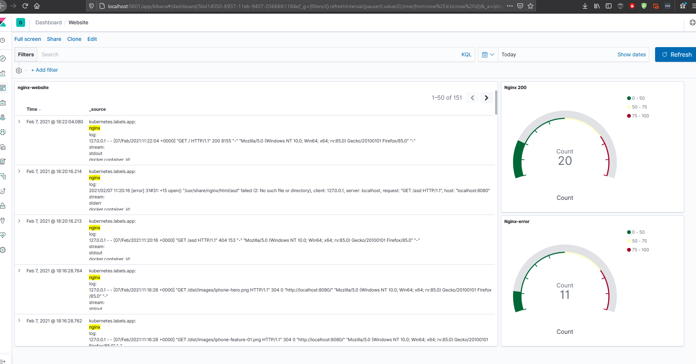
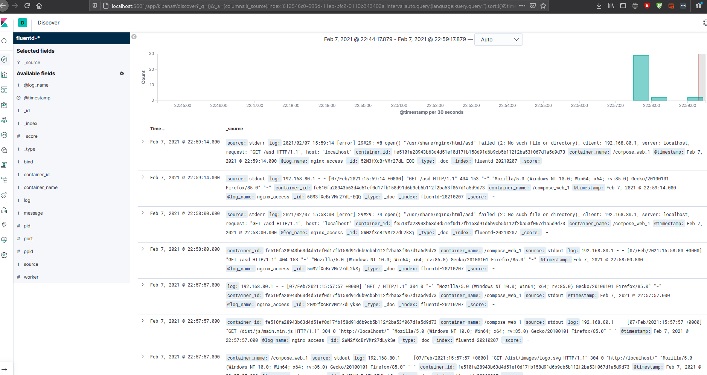

# tvlktht
FIRST SOLUTION
==============================================
Github Stats
Python script that accepts a list of public Github repositories and prints out the name, clone URL, date of latest commit and name of latest author for each one.
1) repostat.py (Read public repository list from repolist.txt and export data to csv format file (repodata.csv))
2) repolist.txt (List of repository for script to get, separated by lines)
3) Dockerfile (Build as docker image)
4) repodata.csv (list of exported data from reposity from github in csv format (generated after script finished))

SECOND SOLUTION
==============================================
Docker Nginx + Log Management
Deploy a Dockerized application serving a static website via (e.g. via Nginx) that displays a custom welcome page (but not the default page for the web server used).
Manage logging using fluentd to ship Nginx request logs to ElasticSearch and Kibana.
1) k8s (deployment manifest for kubernetes)
- create namespace "kube-logging" and "webapp-default" 
  - kubectl create namespace kube-logging
  - kubectl create namespace webapp-default
- Elasticsearch
  Create service
  - kubectl create -f elasticsearch_svc.yaml
  Create StatefullSet
  - kubectl create -f elasticsearch_statefullset.yaml
- fluentd
  Create DaemonSet
  - kubectl create -f fluentd.yaml
- Deploy Kibana
  Create Service and Deployment
  - kubectl create -f kibana.yaml
- Index pattern
  Create index pattern on kibana (logstash-*)
- Nginx
  Create Service and Deployment
  - kubectl create -f nginx.yaml

2) compose (docker compose configuration for standalone)
- docker-compose.yaml (setup standalone containers to get logs from nginx to elasticsearch using fluentd and accessed with kibana)
